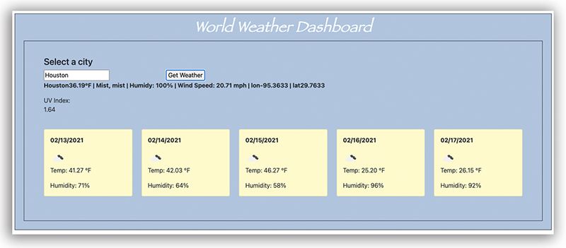

# Weather-Dashboard

This program displays the current weather including the temperature, humidity, wind speed and UV index.

## Description

A weather information deck that searches for a city and displays the current conditions as well as a 5-day outlook. Weather conditions are populated using a third party API (OpenWeather).

## Technologies

* Bootstrap

* HTML

* Javascript

* jQuery

* CSS

_________

## Screenshot

_________

## Link

https://bjenkins63.github.io/Weather-Dashboard/